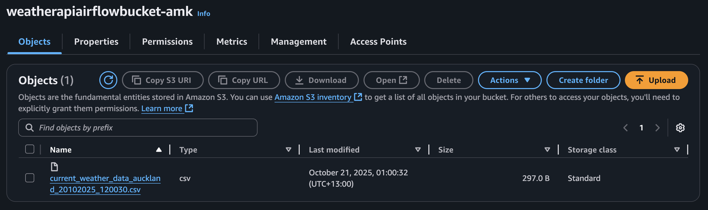

# Weather Data ETL Pipeline (Apache Airflow + AWS S3)

This project implements a simple ETL (Extract, Transform, Load) data pipeline using Apache Airflow to fetch real-time weather data from the OpenWeatherMap API, transform it into a structured format using Pandas, and load it into an AWS S3 bucket for storage.

## Overview

The pipeline performs the following key steps:

- Extract — Uses an HTTP connection to fetch current weather data for a specific city (Auckland) from the OpenWeatherMap API.
- Transform — Parses and transforms the JSON response to extract relevant fields (temperature, humidity, wind speed, etc.) and converts units where needed.
- Load — Saves the transformed dataset as a CSV file in an AWS S3 bucket

## Airflow DAG flow diagram


### Tasks:

- is_weather_api_responsive — Uses HttpSensor to check API availability.
- extract_weather_data — Calls the API and pulls JSON weather data.
- transform_load_weather_data — Transforms the JSON response into a clean CSV and uploads it to S3.

## Project Structure

```
weather-data-etl/
├── dags/
│ └── weather_dag.py                    # Main DAG definition
├── airflow/
│ ├── airflow.cfg                       # Airflow configuration (not on github)
│ ├── airflow.db                        # Metadata database
│ └── logs/                             # Task execution logs
├── aws_credentials.txt                 # Local AWS credentials file (not on github)
├── requirements.txt                    # Python dependencies
└── README.md                           # Project documentation
```


## Output



Structured csv file stored within an AWS S3 bucket. 